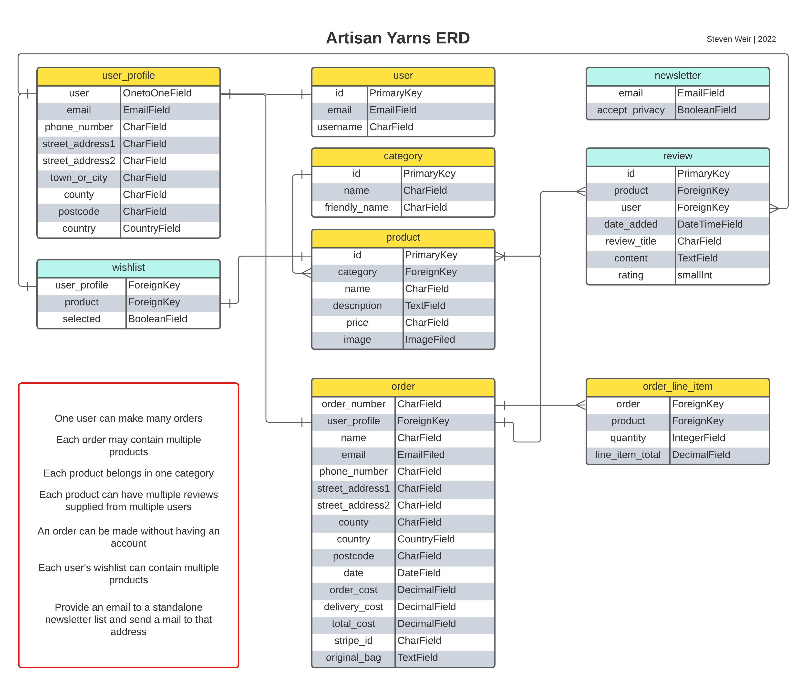
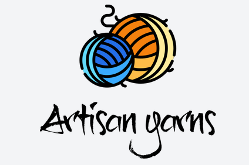

# **Artisan Yarns**
Arts and crafts have always been a part of our lives and have enjoyed a resurgence in recent years, not least for their well documented health benefits.

There is a great satisfaction to be gained from embarking on and completing a new project that reflects ones own personal style. (Not unlike coding).

*Artisan* Yarns is is a small e-commerce store for a hypothetical wool supply shop.  Whilst not a unique offering, it is my hope to further develop it after this course.

The demographic of those who knit and crochet goes well beyond the stereotypical grandparent!

Whilst most prefer the experience of going to a store and getting a feel for the goods, sometimes we just want the convenience of an online order delivered straight to our homes.

link to [deployed site]())

# **Planning Phase**
## **Strategy** 
### **Site Aims**
As an *e-commerce* store, a few minimal requirements ought to be included. A user needs to:
- view the products being sold
- have a way to make a payment 
- be able to provide a delivery address.

To customise the user experience, could they save their details for future visits or see their own order history?

How could the store administer their inventory and update their product list and prices?

A *thought shower* with the above questions in mind can help identify desired store features and separate them into epics. 

### Opportunities
(Scored from 1 minimum to 5 maximum)
Opportunity | Importance | Viability/Feasibility
---|---|---
Users can view all products | 5 | 5
Users can view products by category | 5 | 5
Users can view products by cost | 5 | 5
Users can view individual product details | 5 | 5
Users can search for a product by name / description using the searchbar | 5 | 5
Store owner can add a product | 5 | 5
Store owner can edit a product | 5 | 5
Store owner can delete a product | 5 | 5
Users can register for an account | 5 | 5
Users can login | 5 | 5
Users can logout | 5 | 5
Users can recover their password | 5 | 5
Users can edit their own unique profile | 5 | 5
Users can add products to their wishlist.  They may wish to view it further before commiting to a purchase | 5 | 5
Users can view items in their shopping basket | 5 | 5
Users can adjust the number of items by product line in their shopping basket | 5 | 5
Users can enter payment details to make a purchase | 5 | 5
Users can receive a confirmation email following their purchase | 5 | 5
Users can contact the site owners using a webform | 5 | 5
Users can leave reviews/ratings for each product | 5 | 5
Users can sign up to recieve a newsletter from the site  | 5 | 5
Totals | 105 | 105

User stories will closely follow the above opportunities.  Full disclosure, they have been identified in the *Boutique Ado* walkthrough project.

*Artisan Yarns* will draw quite extensively from the *Boutique Ado* codebase given current developer experience, a 7 week completion deadline and the common themes found on many e-commerce sites.

## **Scope**
The above oppurtunities should be prioritised by balancing completion effort and the importance/value of each desired feature.
User Design (UX) efforts can be categorized into *must*, *should* and *could have*.

**Must Have**
- Users can view all products
- Users can view individual product details
- Users can search for a product by name / description using the searchbar
- Store owner can add a product
- Store owner can edit a product
- Store owner can delete a product
- Users can register for an account
- Users can login
- Users can logout
- Users can edit their own unique profile
- Users can view items in their shopping basket
- Users can adjust the number of items by product line in their shopping basket
- Users can enter payment details to make a purchase

**Should Have**
- Users can view products by category
- Users can view products by cost
- Users can recover their password
- Users can receive a confirmation email following their purchase
- Users can contact the site owners using a webform
- Users can add products to their wishlist.  They may wish to view it further before commiting to a purchase
- Users can leave reviews/ratings for each product
- Users can sign up to recieve a newsletter from the site

**Could Have**
- n/a

Exploring the scope shows the above features to be critical even for a basic e-commerce site.

## **Structure**
flowcharts
  
### **User Stories**

*EPIC - Correspondance*

1- **As a** site user, **I can** contact the site owners using a webform, **so that** I can correspond with the store.

2- **As a** site user, **I can** enter an email address, **so that** I can receive a newsletter from the site.

*EPIC - Viewing and Searching Products*

3 - **As a** site user, **I can** view all products, **so that** I can decide what to purchase.
4 - **As a** site user, **I can** view products by category, **so that** I can narrow my search range.
5 - **As a** site user, **I can** view products by cost, **so that** I can shop within my budget.
6 - **As a** site user, **I can** view individual product details, **so that** I can view each product in greater detail.
7 - **As a** site user, **I can** search for a product by name / description using the searchbar, **so that** I can see if the store has a product I want.

*EPIC - Reviewing Products*
8 - **As a** site user, **I can** add products to a wishlist, **so that** I can view each product in greater detail before commiting to a purchase.
9 - **As a** site user, **I can** leave a review / rating for each product **so that** others can decide if they want to buy the product based upon my experience.

*EPIC - Authentication and User Profiles*
10 - **As a** site user, **I can** register for an account, **so that** I can create my own personal account.
11 - **As a** site user, **I can** login/logout, **so that** I can access my personal account.
12 - **As a** site user, **I can** recover my password, **so that** I can recover access to my personal account. 
13 - **As a** site user, **I can** edit my own unique profile, **so that** I can update my personal details, payment and delivery address information.

*EPIC - Payments & Checkout*
14 - **As a** site user, **I can** view items in their shopping basket, **so that** I can see what I am purchasing.
15 - **As a** site user, **I can** adjust the number of items by product line in their shopping basket, **so that** I can purchase multiples of the same item.
16 - **As a** site user, **I can** enter payment details to make a purchase, **so that** I can make a payment.
17 - **As a** site user, **I can** receive a confirmation email following their purchase, **so that** I can confirm I made a purchase.

*EPIC - Inventory Administration and Store Management*
18 - **As a** site administrator, **I can** add a product, **so that** I can add new items to the store.
19 - **As a** site administrator, **I can** edit a product, **so that** I can change product prices, images and descriptions in the store.
20 - **As a** site administrator, **I can** delete a product, **so that** I can remove items from the store.

## **Skeleton**

### **Wireframes**
Main areas as seen in varying viewport sizes.  Created using [Balsamiq Cloud](https://balsamiq.cloud/).

- [Home](documents/readme/wireframes/home.png "home")
- [Contact Us](documents/readme/wireframes/contact-us.png "contact us")
- [Products](documents/readme/wireframes/products.png "products")
- [Product Detail](documents/readme/wireframes/product-detail.png "product detail")
- [Sign Up](documents/readme/wireframes/sign-up.png "sign up")
- [Sign In](documents/readme/wireframes/sign-in.png "sign in")
- [Sign Out](documents/readme/wireframes/sign-out.png "sign out")
- [Profile](documents/readme/wireframes/profile.png "profile")
- [Wishlist](documents/readme/wireframes/wishlist.png "wishlist")
- [Basket](documents/readme/wireframes/basket.png "basket")
- [Order Confirmation](documents/readme/wireframes/order-confirmation.png "order confirmation")
- [Pay Now](documents/readme/wireframes/pay-now.png "pay now")

### **Database Schema**
Initial Entity Relationship Diagram for the project created using [Lucidchart](https://www.lucidchart.com/pages/ER-diagram-symbols-and-meaning).

UPDATE:

A major flaw with the initial ERD is that items can only belong to one category.  This is too simplisic for the real world.

A particular product will have the characteristics of belonging to both a brand and weight for example.

The category table became somewhat more redundant and served to identify clearance items on queries.

Best solution at this point was to add a brand and category field to the Product model.  Queries could be built of that.  This meant updating the model and making migrations again.

## **Surface**
### **Color scheme**
The submission of this project falls close to Her Majestys Platinum Jubilee.  In celebration of this milestone I have adopted the [official](https://www.royal.uk/sites/default/files/queens_platinum_jubilee_guidelines_2022.pdf) colour scheme of Platinum *#E5E4E2*, Pantone *#61007D* and Gold *#BF9D5E*.

### **Typography**:
Crafting embues a homemade quality.  *Happy Monkey* cursive font supports this as it appears handwritten.  This has been limited to titles and subheadings for readability.

# **Agile Development Process**
[Github Projects](https://github.com/StevenWeir038/Artisan-Yarns/projects) serves as an Agile tool for this project.
Through it, user stories, issues and tasks are planned and tracked on a weely basis using a basic Kanban.

# **Features**
For example, logo, landing page, site nav, headeer, footer, allauth authentication, pagination, error pages etc
After frontend development pass images into README.

## **Logo**

# **Future development**
Why not introduce a colour field into the product model to enhance product searches?  Matching colour is an integral part when selecting yarn for projects.

# **Testing Phase**

Separate document [TESTING.md](TESTING.md).

# **Deployment**
The final Deployed site can be found [here])
Separate document [DEPLOYMENT.md](DEPLOYMENT.md).

# **Technologies used**
- Github for repository storage
- Gitpod IDE/ CI template to develop site
- Logo created using [Tailor Brands](https://studio.tailorbrands.com/)
- Fonts generated using [Google Fonts](https://fonts.google.com/)
- [Balsamiq Cloud](https://balsamiq.cloud/) to build wireframes
- [Lucidchart](https://www.lucidchart.com/pages/ER-diagram-symbols-and-meaning) to build/contectualize database tables/fields and their relationships.
- [Adobe Express](https://express.adobe.com/sp) to crop/resize images
- [Pillow](https://pillow.readthedocs.io/en/stable/index.html) to display product image fields.

# **Credits**
## Mentions
- My mentor [Tim Nelson](https://tim.2bn.dev/) always goes top of the list.  My thanks to him for a year of encouragement and insight.  He truely is committed to his students coding knowledge and personal growth.

- David Bowers and Helena Johansson for their personal support and input.  Just being there means alot.

- [John Elder](https://www.youtube.com/watch?v=N-PB-HMFmdo) for hiu suseful tutorial on pagination.

- The CI Slack community
- [The Spruce](https://www.google.com/search?q=yarn+weights&rlz=1C1CHBF_enGB798GB798&tbm=isch&source=iu&ictx=1&vet=1&fir=BQ2vxWKzXIGV-M%252C2DziQcFqDw_1GM%252C_%253B-q9lbQ790NJA7M%252Cd0r7KMH96MKkXM%252C_%253BghAgYuU1Mkd0AM%252C5XxAZ9DCXUEpmM%252C_%253BoMKhkyb6LVgL8M%252C8DJRGcSzIT5FpM%252C_%253BoFmAvPyPDhLTeM%252CPOPUPMZDOIwXEM%252C_%253Bsio_5yPcSpblhM%252Cuw4hoiDQCPSziM%252C_%253BOtnXG_I689btLM%252Cn28eU-0aen0XWM%252C_%253Bb_G1ozWA-n8UrM%252CQ8f1TjrDlrkb8M%252C_%253BjKGTpBPrkFaduM%252COd35IuVvdS1RvM%252C_%253BnVH89PCPv7cvnM%252C94fp5E7wlZzEDM%252C_%253B__wvHj1OWU-14M%252Cg_I5WqW1b8Bx3M%252C_%253BB894wUvPOHINsM%252CAUX-s_h3V8VRRM%252C_%253BSLcEsJITgL1fqM%252CLss4mpiOTdrCBM%252C_%253BT6d04DPlKm4jzM%252CpL9IJwO0zlQgeM%252C_%253B555JRiZbSgTDhM%252CTtBoyL8JvpUmhM%252C_%253BqHYCDc1q9guQGM%252CTIhdpGfsdkoBiM%252C_&usg=AI4_-kQvtyzGRv7ffgq_pMRkGnpxrlOPkA&sa=X&ved=2ahUKEwjzi8zG08P4AhXTSUEAHUU6CNoQ9QF6BAgIEAE#imgrc=BQ2vxWKzXIGV-M) for their useful information on yarn weights.

## Images
Images taken from unsplash.
- Landing page image 1 by [Karen Penrose](https://unsplash.com/photos/06ZTGDcAQFs)
- Landing page image 2 by [Olliss](https://unsplash.com/photos/bXYBPscCnQc)
- Landing page image 3 by [Kelly Sikkema](https://unsplash.com/photos/M6lApC0hEpg)
- Landing page image 4 by [Cintia](https://mypoppet.com.au/makes/make-a-giant-magic-yarn-ball-from-yarn-scraps/)
- Landing page image 5 by [Olliss](https://unsplash.com/photos/7mJj0Boa4jc)

Product Images

- [Yummy](https://www.chenilleyarn.co.uk/)
- [Adriafil](https://www.woolstack.co.uk/)
- [Scheppjes](https://www.scheepjes.com/)
- [New Fashion](https://www.thewoolfactory.co.uk/)
- [Needles and Hooks](https://www.etsy.com/)