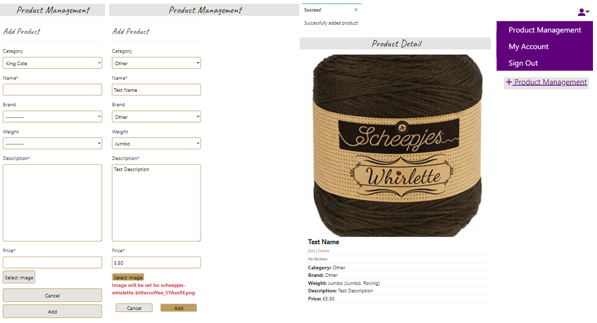

# **Artisan Yarns**
Arts and crafts have been a part of our lives since the dawn of civilisation.
They have enjoyed a resurgence in recent years, not least for their well documented mental health benefits.

There is a great satisfaction to be gained from embarking on and completing a project that reflects ones own personal style.

This project is a personal indulgence and reflects my love of both crafts and coding.  Both are a never ending journey which forms part of their appeal!

The project's overall aim is to deliver a small e-commerce site for a hypothetical yarn supply store called *Artisan Yarns*.  Whilst not a unique offering, it is my hope to further develop it after this course as more expertise is required to make it truely shine.

As for its justification, many crafters prefer the experience of going to a store and getting a feel for a product.  However, there is a niche for those know what they want and desire the convenience of an online order delivered straight to their home.

link to [deployed site]())

# **Planning Phase**
## **Strategy** 
### **Site Aims**
As an *e-commerce* store, a few minimal requirements ought to be included. A user needs to:
- view the products being sold
- have a way to make a payment 
- be able to provide a delivery address.

To customise the user experience, could they save their details for future visits or see their own order history?

How could the store administer their inventory and maintain their product list and prices?

A *thought shower* with the above questions in mind can help identify desired store features and separate them into epics. 

### Opportunities
(Scored from 1 minimum to 5 maximum)
Opportunity | Importance | Viability/Feasibility
---|---|---
Users can view all products | 5 | 5
Users can view products by category | 5 | 5
Users can view products by cost | 5 | 5
Users can view individual product details | 5 | 5
Users can search for a product by name / description using the searchbar | 5 | 5
Store owner can add a product | 5 | 5
Store owner can edit a product | 5 | 5
Store owner can delete a product | 5 | 5
Users can register for an account | 5 | 5
Users can login | 5 | 5
Users can logout | 5 | 5
Users can recover their password | 5 | 5
Users can edit their own unique profile | 5 | 5
Users can add products to their wishlist.  They may wish to view it further before commiting to a purchase | 5 | 5
Users can view items in their shopping basket | 5 | 5
Users can adjust the number of items by product line in their shopping basket | 5 | 5
Users can enter payment details to make a purchase | 5 | 5
Users can receive a confirmation email following their purchase | 5 | 5
Users can contact the site owners using a webform | 5 | 5
Users can leave reviews/ratings for each product | 5 | 5
Users can sign up to recieve a newsletter from the site  | 5 | 5
Totals | 105 | 105

User stories will closely follow the above opportunities.  Full disclosure, they have been identified in the *Boutique Ado* walkthrough project.

*Artisan Yarns* will draw quite extensively from the *Boutique Ado* codebase given the developer's current experience and a 7 week completion deadline.
Getting something just right does seem to take a bit longer than intended.

In hindsight, given my current skillset, I would consider the above delivery a little too optimistic as I've only been using the Django Framework for the past 4 months on a part time basis.  It's important to acknowledge such limitations whilst striving to learn more.

## **Scope**
The above oppurtunities should be prioritised by balancing completion effort and the importance/value of each desired feature.
User Design (UX) efforts can be categorized into *must*, *should* and *could have*.

**Must Have**
- Users can view all products
- Users can view individual product details
- Users can search for a product by name / description using the searchbar
- Store owner can add a product
- Store owner can edit a product
- Store owner can delete a product
- Users can register for an account
- Users can login
- Users can logout
- Users can edit their own unique profile
- Users can view items in their shopping basket
- Users can adjust the number of items by product line in their shopping basket
- Users can enter payment details to make a purchase

**Should Have**
- Users can view products by category
- Users can view products by cost
- Users can recover their password
- Users can receive a confirmation email following their purchase
- Users can contact the site owners using a webform
- Users can add products to their wishlist.  They may wish to view it further before commiting to a purchase
- Users can leave reviews/ratings for each product
- Users can sign up to recieve a newsletter from the site

**Could Have**
- n/a

Exploring the scope shows the above features to be critical even for a basic e-commerce site.  Nearing the end of the project, achieving them all feels a little too neat.  There are always more useful features to develop/include. 
  
### **User Stories**

*EPIC - Correspondance*

1- **As a** site user, **I can** contact the site owners using a webform, **so that** I can correspond with the store.

2- **As a** site user, **I can** enter an email address, **so that** I can receive a newsletter from the site.

*EPIC - Viewing and Searching Products*

3 - **As a** site user, **I can** view all products, **so that** I can decide what to purchase.

4 - **As a** site user, **I can** view products by category, **so that** I can narrow my search range.

5 - **As a** site user, **I can** view products by cost, **so that** I can shop within my budget.

6 - **As a** site user, **I can** view individual product details, **so that** I can view each product in greater detail.

7 - **As a** site user, **I can** search for a product by name / description using the searchbar, **so that** I can see if the store has a product I want.

*EPIC - Reviewing Products*

8 - **As a** site user, **I can** add products to a wishlist, **so that** I can view each product in greater detail before commiting to a purchase.

9 - **As a** site user, **I can** leave a review / rating for each product **so that** others can decide if they want to buy the product based upon my experience.

*EPIC - Authentication and User Profiles*

10 - **As a** site user, **I can** register for an account, **so that** I can create my own personal account.

11 - **As a** site user, **I can** login/logout, **so that** I can access my personal account.

12 - **As a** site user, **I can** recover my password, **so that** I can recover access to my personal account.

13 - **As a** site user, **I can** edit my own unique profile, **so that** I can update my personal details, payment and delivery address information.

*EPIC - Payments & Checkout*

14 - **As a** site user, **I can** view items in their shopping basket, **so that** I can see what I am purchasing.

15 - **As a** site user, **I can** adjust the number of items by product line in their shopping basket, **so that** I can purchase multiples of the same item.

16 - **As a** site user, **I can** enter payment details to make a purchase, **so that** I can make a payment.

17 - **As a** site user, **I can** receive a confirmation email following their purchase, **so that** I can confirm I made a purchase.

*EPIC - Inventory Administration and Store Management*

18 - **As a** site administrator, **I can** add a product, **so that** I can add new items to the store.

19 - **As a** site administrator, **I can** edit a product, **so that** I can change product prices, images and descriptions in the store.

20 - **As a** site administrator, **I can** delete a product, **so that** I can remove items from the store.

## **Skeleton**

### **Wireframes**
Main areas as seen in varying viewport sizes.  Created using [Balsamiq Cloud](https://balsamiq.cloud/).

Note, due to the nature of a student lead development and lack of consumer feedback, there may be a few alterations as to how individual elements are displayed.

- [Home](documents/readme/wireframes/home.png "home")
- [Contact Us](documents/readme/wireframes/contact-us.png "contact us")
- [Products](documents/readme/wireframes/products.png "products")
- [Product Detail](documents/readme/wireframes/product-detail.png "product detail")
- [Sign Up](documents/readme/wireframes/sign-up.png "sign up")
- [Sign In](documents/readme/wireframes/sign-in.png "sign in")
- [Sign Out](documents/readme/wireframes/sign-out.png "sign out")
- [Profile](documents/readme/wireframes/profile.png "profile")
- [Wishlist](documents/readme/wireframes/wishlist.png "wishlist")
- [Basket](documents/readme/wireframes/basket.png "basket")
- [Order Confirmation](documents/readme/wireframes/order-confirmation.png "order confirmation")
- [Pay Now](documents/readme/wireframes/pay-now.png "pay now")

### **Database Schema**
Initial Entity Relationship Diagram for the project created using [Lucidchart](https://www.lucidchart.com/pages/ER-diagram-symbols-and-meaning).

UPDATE:

A major flaw with the initial ERD is that items can only belong to one category.  This is too simplisic for the real world.

A particular product will have the characteristics of belonging to both a brand and weight for example.

The category table became somewhat more redundant and served to identify clearance items on queries.

Best solution at this point was to add a brand and category field to the Product model.  Queries could be built of that.  This meant updating the model and making migrations again.

## **Surface**
### **Color scheme**
The development of this project fell close to the Queen's [Platinum Jubilee](https://www.royal.uk/sites/default/files/queens_platinum_jubilee_guidelines_2022.pdf).

I have adopted the colour scheme of Platinum *#E5E4E2*, Pantone *#61007D* and Gold *#BF9D5E* as they have a connotation of luxury.

### **Typography**:
Crafting embues a homemade quality.  *Happy Monkey* cursive font supports this as it appears handwritten.  This has been limited to titles and subheadings for readability. [Google Fonts](https://fonts.google.com/) is an excellent tool to import various fonts into any project.

# **Agile Development Process**
[Github Projects](https://github.com/StevenWeir038/Artisan-Yarns/projects) served as an Agile tool for this project.  It isn't a specialise tool but with the right tags and project creation/issue assignments is can be made to work.

Through it, user stories, issues and tasks were planned and tracked on a weekly basis using a basic Kanban.

On reflection, in the beginning it was a pain to use a Kanban approach.  In the end, I was praising it's merits.

It was a window on the issues encountered and solutions employed at different stages of the project.

If this approach was useful at an individual level, then I can see it is an imperative when collaborating with others.

# **Features**
### **Logo**
Businesses often adopt a unique livery.  For this site the following will act as a signiture.
Credit to [Tailor Brands](https://studio.tailorbrands.com/login) in creating a bespooke brand label.

## Required Applcations
Authentication - Sign In / Sign Out / Sign Up

### Profile
Includes:
- header and footer likns available to authenticated users only
- responsive layout for small, medium and large screen sizes
- personalised sub header with account users name
- form to display/update delivery details
- scrollable order history with links to drill down into individual order
- alert message to tell user they are viewing a historic order, now a live order
- redirect to profile button instead of back to store button if order viewed from profile

### Error Pages
404 & 500

### Header
Includes:
- artisan yarn icon as as a home link
- searchbar to find and display products in the store
- collapsible menu for smaller scree sizes
- wishlist only available to authenticated users
- bespooke dropdown menu for user accounts to sign up, sign in, sign out, view/edit own profile (authenticated users only) and manage product (authenticated superusers only)

### Footer
Includes:
- responsive layout for small, medium and large screen sizes
- newsletter section.  It was place here specifically so the user can sign up from any site page
- back to top button
- social links
- general business information
- menu shortcuts. Note *My Account* only available when authenticated and *Product Management* only available to authenticated superusers. 

    
### Homepage
Includes:
- responsive layout for very small, small and medium+ screen sizes
- as with major retailer sites, larger images are set up as links to direct to specific store areas

### Products
Includes:
- pagination
- default no image placeholder if no image is in the database
- dropdown menu to sort by price, name and category in standard or reverse order
- number of product cards displayed per row is responsive to screen size
    - small - 1 card
    - medium - 2 cards
    - large - 3 cards
    - extra large - 4 cards

### Product Detail
Includes:
- responsive layout for different screen sizes 
- buttons use fontawesome icons on small screens to save space
- buttons like to convenient pages in the store
- user can adjust the quantity of items before adding to basket
- store owners (set up as superusers) can edit or delete the product
- count and average (mode) star rating calcuated by existing reviews is visible
- useful info about the product is displayed

### Product Management
The store owner has been given frontend CRUD functionality for ease of access/manage their product database.
They still have the option of using Django Admin if they prefer.

Includes:
- header, footer and edit/delete links in product detail only accessibile by site owner/superuser
- form to add fields
- form to edit fields
- alerts for a successsful item addition, edit, update and deletion

### Basket
Includes:
- header and footer links available to users as users don't have to be signed in to make a purchase
- add item to basket must be done in product detail page
- upon adding an item a customised toast provides:
    - message telling user what item they added
    - a count of total basket items
    - a scrollable list of items including their image, name, quantity and price
    - subtotal of all basket items
    - useful shortcut buttons to return to store (to continue shopping) or got to checkout to enter payment details
- the basket page is essentially the same thing with 4 other pieces of functionality
    - user can increment/decrement the number of items they order from a validated element (1-99)
    - view the item subtotal after each update
    - remove the item from the their basket
    - view a basket total after each update/deletion

### Checkout
Includes:
- responsive page layout for different viewport sizes
- an itemised list of basket items
- prepoulated delivery details taken from user profile (if authenticated)
- standardized buttons to return to store, return to basket or securely pay using stripe
- spinner to show user payment is being processed.  Reduces the chance of them refreshing page and being double charged etc
- toast showing user successful/unsuccessful payment
- users should receive an email with their order detail. (The below example is of a different order) 

## Bespoke Applcations
### Reviews
Includes:
- displayed on the same page of a specific product as that is the relevant context
- only authenticated users can see the review form.  This intentionally limits review postings to registered users
- rather than leave a specific date/time of posting, django template displays how long ago the post was made
- counter for the number of review on the product
- most recent postings are displayed at the top
- displays rating with start pictograms rather than a number

### Wishlist
Includes:
- header and footer links only available to authorized users
- itemised list of items added to wishlist
- items cannot be duplicated in the wishlist (to reduce clutter)
- alerts when an items is added, removed or if already listed
- small image, product name, cost and description
- bin icon to delete listed item
- basket icon to take user to product detail page where they can then add the item to the basket
- bin and basket buttons intentionally placed apart for ease of use on mobile screens

### Newsletter
Includes:
- one field only (email) to encourage easier signup to the service
- embedded in the footer for accessibility across the whole site

### Contact
Includes:
- header and footer links
- simple 4 field form including name, email, subject and message
- post button for the form content to be emailed to the site owner

# **Future development opportunities**
There is always room for improvement.  Some that are strikingly obvious include but require more time to implement:
- introducing a colour field into the product model to enhance product searches?  Matching colour is an integral part when selecting yarn for projects. Ideally use a div with border-radius of 50% filled with the palette colour instead of a name.
- stock availability. A store has a finite amount of product items by line.  Why not check if there are enough items in stock when a user is making an order?  Running low on an item?  Maybe tell the user.  Put subtle pressure on them to buy the item while they can.
- currently the user is directed from the wishlist to manually add a product to their basket.  Automate this.  Link the wishlist into the basket contexct processor.
- improve defensive programming.  When deleting items from the basket or wishlist, it's better to ask the user if they are sure to avoid accidental deletion.
- buttons.  I went down the rabbit hole of responsive button sizes.  Keep it simple.  Button sizes can be reatively static without affective user experience.  Also less cumbersome to maintain in terms of `css` and `bootstrap` classes therefore improving code maintainability.
- Javascript driven filter positioned left in the products page to filter categories/products by weight/cost etc

# **Testing Phase**
Separate document [TESTING.md](TESTING.md).

# **Deployment**
The final Deployed site can be found [here](https://artisan-yarns.herokuapp.com/)
Separate document [DEPLOYMENT.md](DEPLOYMENT.md).

# **The requirements for an e-commerce business model:** STILL TO DO
The necessity for the inclusion of an e-commerce business model, highlighting the purpose of the application as either B2B or B2C focused, and detailing the core business intents and marketing strategies for the application.

# **Social Media Marketing & Search Engine Optimization (SEO)**
Creating a strong social base (with participation) and linking that to the business site can help drive sales.  Using more popular providers with a wider user base such as Facebook typically maximises site views.

As this is a student led project there is a possibility that the [Artisan Yarns](https://www.facebook.com/Artisan-Yarns-101716042612963) page may be deleted.  That's ok.  They wouldn't want their platform cluttered with fake businesses.

The below screen capture should hopefully demonstrate the developers intent.

# **Technologies used**
- Github for repository storage
- Gitpod IDE/ CI template to develop site
- [Django](https://www.djangoproject.com/)
- [Bootstrap4](https://getbootstrap.com/docs/4.6/getting-started/introduction/)
- [HTML5](https://developer.mozilla.org/en-US/docs/Glossary/HTML5)
- [CSS3](https://www.w3.org/Style/CSS/Overview.en.html)
- [JQuery](https://jquery.com/)
- [Heroku](https://www.heroku.com)
- [AWS](https://aws.amazon.com/)
- [Stripe](https://stripe.com/en-gb)
- Logo created using [Tailor Brands](https://studio.tailorbrands.com/)
- Fonts generated using [Google Fonts](https://fonts.google.com/)
- [Balsamiq Cloud](https://balsamiq.cloud/) to build wireframes
- [Lucidchart](https://www.lucidchart.com/pages/ER-diagram-symbols-and-meaning) to build/contectualize database tables/fields and their relationships.
- [Adobe Express](https://express.adobe.com/sp) to crop/resize images
- [Pillow](https://pillow.readthedocs.io/en/stable/index.html) to display product image fields.
- [Chrome DevTools](https://developer.chrome.com/docs/devtools/) for testing, style checking and debugging

# Resources
Reading and understanding the documentation made life easier.  You wouldn't build furniture without the instructions would you?
- [Django documentation](https://www.djangoproject.com/).
- [Bootstrap documentation](https://getbootstrap.com/docs/4.6/getting-started/introduction/)
- [Stripe](https://stripe.com/docs/payments?payments=popular)
- [Code Institute Course Materials](https://codeinstitute.net/full-stack-software-development-diploma/?utm_term=code%20institute&utm_campaign=CI+-+UK+-+Search+-+Brand&utm_source=adwords&utm_medium=ppc&hsa_acc=8983321581&hsa_cam=1578649861&hsa_grp=62188641240&hsa_ad=581730217381&hsa_src=g&hsa_tgt=kwd-319867646331&hsa_kw=code%20institute&hsa_mt=e&hsa_net=adwords&hsa_ver=3&gclid=Cj0KCQjw2_OWBhDqARIsAAUNTTGuqjzZXJQaJfo7xNLguOc6Cu-9MDllgPV4dWDLkgOsNsrjeSacjc0aAjajEALw_wcB)

General reference and troubleshooting
- [Stack Overflow](https://stackoverflow.com/)
- [MDN](https://developer.mozilla.org/en-US/)
- [W3schools](https://www.w3schools.com/)

# **Credits**
## Mentions
Support
- My mentor [Tim Nelson](https://tim.2bn.dev/). A true gent. My thanks to him for a seemingly short year and leaving an indelible mark on my approach.  His commitment to his students' knowledge and personal growth is second to none.

- Special thanks to [Chris Quinn](https://github.com/10xOXR) for his assistance mid-project.  His explanations were of great help.

- [David Bowers](https://github.com/dnlbowers) and Helena Johansson for their personal support and input.  Just being there means alot.

- The CI Slack community for its encouragement and threads that helped me figure out most issues without tutor support.

- [John Elder](https://www.youtube.com/watch?v=N-PB-HMFmdo) and [Vitor Freitas](https://simpleisbetterthancomplex.com/tutorial/2016/08/03/how-to-paginate-with-django.html) for their useful tutorials on Django pagination.

- [The Spruce](https://www.google.com/search?q=yarn+weights&rlz=1C1CHBF_enGB798GB798&tbm=isch&source=iu&ictx=1&vet=1&fir=BQ2vxWKzXIGV-M%252C2DziQcFqDw_1GM%252C_%253B-q9lbQ790NJA7M%252Cd0r7KMH96MKkXM%252C_%253BghAgYuU1Mkd0AM%252C5XxAZ9DCXUEpmM%252C_%253BoMKhkyb6LVgL8M%252C8DJRGcSzIT5FpM%252C_%253BoFmAvPyPDhLTeM%252CPOPUPMZDOIwXEM%252C_%253Bsio_5yPcSpblhM%252Cuw4hoiDQCPSziM%252C_%253BOtnXG_I689btLM%252Cn28eU-0aen0XWM%252C_%253Bb_G1ozWA-n8UrM%252CQ8f1TjrDlrkb8M%252C_%253BjKGTpBPrkFaduM%252COd35IuVvdS1RvM%252C_%253BnVH89PCPv7cvnM%252C94fp5E7wlZzEDM%252C_%253B__wvHj1OWU-14M%252Cg_I5WqW1b8Bx3M%252C_%253BB894wUvPOHINsM%252CAUX-s_h3V8VRRM%252C_%253BSLcEsJITgL1fqM%252CLss4mpiOTdrCBM%252C_%253BT6d04DPlKm4jzM%252CpL9IJwO0zlQgeM%252C_%253B555JRiZbSgTDhM%252CTtBoyL8JvpUmhM%252C_%253BqHYCDc1q9guQGM%252CTIhdpGfsdkoBiM%252C_&usg=AI4_-kQvtyzGRv7ffgq_pMRkGnpxrlOPkA&sa=X&ved=2ahUKEwjzi8zG08P4AhXTSUEAHUU6CNoQ9QF6BAgIEAE#imgrc=BQ2vxWKzXIGV-M) for their useful information on yarn weights.

## Images
Images taken from unsplash.
- Landing page image 1 by [Karen Penrose](https://unsplash.com/photos/06ZTGDcAQFs)
- Landing page image 2 by [Olliss](https://unsplash.com/photos/bXYBPscCnQc)
- Landing page image 3 by [Kelly Sikkema](https://unsplash.com/photos/M6lApC0hEpg)
- Landing page image 4 by [Cintia](https://mypoppet.com.au/makes/make-a-giant-magic-yarn-ball-from-yarn-scraps/)
- Landing page image 5 by [Olliss](https://unsplash.com/photos/7mJj0Boa4jc)
- Page tab [favicon](https://icons8.com/icons/set/yarn)

Product Images

- [Yummy](https://www.chenilleyarn.co.uk/)
- [Adriafil](https://www.woolstack.co.uk/)
- [Scheppjes](https://www.scheepjes.com/)
- [New Fashion](https://www.thewoolfactory.co.uk/)
- [Needles and Hooks](https://www.etsy.com/)