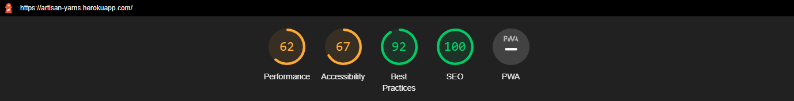
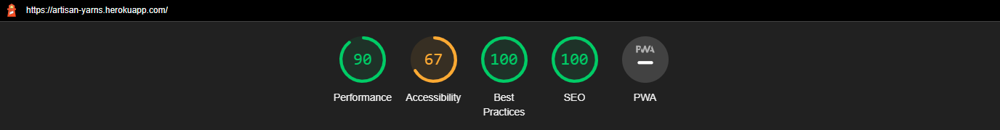

# Manual Testing

## **Authentication**
| FEATURE | EXPECTED | TEST METHOD | RESULT | PASS/FAIL |
| -- | -- | -- | -- | :--: |
| Sign Up link | redirects unauth to Sign Up page | click on link | redirects to Sign Up page | Pass |
| Sign In link |  redirects  unauth to Sign In page| click on link | redirects to Sign In page | Pass |
| Sign Out link | redirects auth user to Sign Out page | click on link | redirects to Sign Out page | Pass |
| Sign Up page button | on success, redirects user to confirm email page and displays info toast for user to check their email | click sign in button | on success, redirects user to confirm email page and displays info toast for user to check their email | Pass |
| Confirm page button | clicking on sent email link takes user back to the site's confirm email page, confirm button verifies their email, redirects to the sign in page and displays success toast | click confirm button | clicking on sent email link takes user back to the site's confirm email page, confirm button verifies their email, redirects to the sign in page and displays success toast | Pass |
| Sign In page button | redirects auth user to homepage and displays success toast with auth users name page OR remains on sign in page and display error message stating incorrect username/password | click sign in button | redirects auth user to homepage and displays success toast with auth users name page OR remains on sign in page and display error message stating incorrect username/password | Pass |
| Sign Out page button | redirects auth user to homepage and displays success toast with signed out message  | click sign out button | redirects auth user to homepage and displays success toast with signed out message | Pass |

&nbsp;

## **Navigation**
### **Header Site Links**
| FEATURE | EXPECTED | TEST METHOD | RESULT | PASS/FAIL |
| -- |--| --| -- | :--: |
| Home image | redirect to homepage from anywhere in site | click on homepage link  | navigates to home | Pass |
| Contact button | redirect to contact page from anywhere in site | click on contact page button | navigates to contact page | Pass |
| Help button | opens help modal | click on help button  | opens help modal | Pass |
| Wishlist button (visible to auth users only) | redirect to wishlist page from anywhere in site | click on wishlist button | navigates to wishlist page | Pass |
| Basket button | redirect to basket page from anywhere in site | click on basket button | navigates to basket page | Pass |
| Account button (unauth users) | dropdown menu opens with 2 options - Sign Up / Sign In | click on account button | dropdown menu opens with 2 options - Sign Up / Sign In | Pass |
| Account button (auth standard users) | dropdown menu opens with 2 options - My Acccount / Sign Out | click on account button | dropdown menu opens with 2 options - My Acccount / Sign Out | Pass |
| Account button (auth superusers) | dropdown menu opens with 3 options - Product Management / My Acccount / Sign Out | click on account button | dropdown menu opens with 3 options - Product Management / My Acccount / Sign Out | Pass |

&nbsp;

### **Header Product Menu**
| FEATURE | EXPECTED | TEST METHOD | RESULT | PASS/FAIL |
| -- | -- | -- | -- | :--: |
| Products menu item | shows dropdown menu with 3 options for all products, price, category | click on products menu item  | shows dropdown menu with 3 options for all products, price, category | Pass |
| Products menu list items | redirects to filtered all_product page containing items for all products | click on products menu list item  | redirects to filtered all_product page containing items for all products | Pass |
| Products menu list items | redirects to filtered all_product page containing items with list item name in its `category` field | click on products menu list item  | redirects to filtered all_product page containing items with list item name in its `category` field | Pass |
| Yarns menu item | shows dropdown menu with 5 options for all yarns, and each name from the `brand` field in the `Product` model | click on products menu item  | shows dropdown menu with 5 options for all yarns, and each name from the `brand` field in the `Product` model | Pass |
| Yarns menu list items | redirects to filtered all_product page containing items from all categories excluding `other` | click on yarns menu list item  | redirects to filtered all_product page containing items with list item name in its `category` field | Pass |
| Yarns menu list items | redirects to filtered all_product page containing items with list item name in its `category` field | click on yarns menu list item  | redirects to filtered all_product page containing items with list item name in its `category` field | Pass |
| Clearance menu item | redirects to filtered all_product page containing items with `clearance` in their `category` field | click on clearance menu item  | redirects to filtered all_product page containing items with `clearance` in their `category` field | Pass 
| Accessories menu item | redirects to filtered all_product page containing items with `accessories` in their `category` field | click on accessories menu item  | redirects to filtered all_product page containing items with `accessories` in their `category` field | Pass 

&nbsp;

### **Footer Back To Top Button**
| FEATURE | EXPECTED | TEST METHOD | RESULT | PASS/FAIL |
| -- | -- | -- | -- | :--: |
| btt button | auto scrolls to top of current page | click btt button | auto scrolls to top of current page | Pass |

&nbsp;

### **Footer Site Links**
| FEATURE | EXPECTED | TEST METHOD | RESULT | PASS/FAIL |
| -- |--| --| -- | :--: |
| Home image | redirect to homepage from anywhere in site | click on homepage link  | navigates to home | Pass |
| Contact link | redirect to contact page from anywhere in site | click on contact page link | navigates to contact page | Pass |
| Help link | opens help modal | click on help link  | opens help modal | Pass |
| Wishlist link (visible to auth users only) | redirect to wishlist page from anywhere in site | click on wishlist link | navigates to wishlist page | Pass |
| Basket link | redirect to basket page from anywhere in site | click on basket link | navigates to basket page | Pass |
| Account link (unauth users) | dropdown menu opens with 2 options - Sign Up / Sign In | click on account link | dropdown menu opens with 2 options - Sign Up / Sign In | Pass |
| Account link (auth standard users) | dropdown menu opens with 2 options - My Acccount / Sign Out | click on account link | dropdown menu opens with 2 options - My Acccount / Sign Out | Pass |
| Account link (auth superusers) | dropdown menu opens with 3 options - Product Management / My Acccount / Sign Out | click on account link | dropdown menu opens with 3 options - Product Management / My Acccount / Sign Out | Pass |

&nbsp;

### **Footer External Site Links**
| FEATURE | EXPECTED | TEST METHOD | RESULT | PASS/FAIL |
| -- | -- | -- | -- | :--: |
| Facebook Icon | redirect to external facebook page from anywhere in site | click on facebook icon link  | navigates to external facebook page | Pass |
| Instagram Icon | redirect to external instagram page from anywhere in site | click on instagram icon link  | navigates to external instagram page | Pass |
| GitHub Icon | redirect to developers personal github page (new tab/external) from anywhere in site | click on github icon link  | navigates to developers personal github page (new tab/external) | Pass |

&nbsp;

## **Header Searchbar**
| FEATURE | EXPECTED | TEST METHOD | RESULT | PASS/FAIL |
| -- | -- | -- | -- | :--: |
| searchbar form input | redirects to filtered all_product page containing items with the search parameter in their title or description | type something into search form | redirects to filtered all_product page containing items with the search parameter in their title or description | Pass |
| searchbar for input | redirects to product page and displays error toast if no input made when search form submitted | type nothing into search form and submit | redirects to product page and displays error toast if no input made when search form submitted | Pass |

&nbsp;

## **Footer Newsletter**
| FEATURE | EXPECTED | TEST METHOD | RESULT | PASS/FAIL |
| -- | -- | -- | -- | :--: |
| email form input | valid email triggers success toast, redirects to newsletter, sends email to recipient | enter valid email to form input or with an `@` | valid email triggers success toast, redirect to newsletter page, sends email to recipient | Pass |
| email form input | invalid email triggers warning to fill out field | enter with no input or without `@` | triggers warning to fill out field. Focus reset to input field for another try | Pass |
| subscribe button | performs valid/invalid action depending on input field | click subscribe button | performs valid/invalid action depending on input field | Pass |

&nbsp;

## **Homepage**
| FEATURE | EXPECTED | TEST METHOD | RESULT | PASS/FAIL |
| -- | -- | -- | -- | :--: |
| Enter store image | navigates to all_product page | click on enter store image | navigates to all_product page | Pass |
| Clearance image | navigates to all_product page filtered for clearance items only | click on clearance image | navigates to all_product page filtered for clearance items only | Pass |
| Schweepjes image | navigates to all_product page filtered for schweepjes items only | click onschweepjes image | navigates to all_product page filtered for schweepjes items only | Pass |
| Lighter Weights image | navigates to all_product page filtered for items with a value of `Light` in the `Product` model `weight` field | click on lighter weights image | navigates to all_product page filtered for items with a value of `Light` in the `Product` model `weight` field | Pass |
| Accessories image | navigates to all_product page filtered for accessories items only | click on accessories image | navigates to all_product page filtered for accessories items only | Pass |

&nbsp;

## **Products Pages**
### **Products**
| FEATURE | EXPECTED | TEST METHOD | RESULT | PASS/FAIL |
| -- | -- | -- | -- | :--: |
| All products visible | Products page shows all products | open all products_page | Products page shows all products | Pass |
| pagination | display no more than 8 products per page | open all products_page, cycle through pagination buttons | Each page has a maximum of 8 product cards | Pass |
| product cards | redirects to product_detail page for selected card | click on individual product card | redirects to product_detail page for selected card | Pass |
| Sort by price, name, category | products display depending on option selected including order/reverse order | select option from dropdown | products display as per option selected including order/reverse order | Pass |

&nbsp;

### **Product Details**
| FEATURE | EXPECTED | TEST METHOD | RESULT | PASS/FAIL |
| -- | -- | -- | -- | :--: |
| Edit product link (superuser only) | redirect to edit product page | click edit link | redirect to edit product page | Pass |
| Delete product link (superuser only) | redirect to product page, display success toast with message | click delete link | redirect to product page, display success toast with message | Pass |
| Rating | If not reviewed, no star rating, if reviewed show avg rating with star pictograms | open product_detail page | If not reviewed, star rating blank, if reviewed show avg rating with star pictograms | Pass |
| Reviews (unauth users) | If not reviewed, state no reviews, if reviewed link to display reviews section, display number reviews on the link, disable add review link | open product_detail page | If not reviewed, state no reviews, if reviewed link to display reviews section, display number reviews on the link, disable add review link | Pass |
| Reviews (auth users) | If not reviewed, state no reviews, if reviewed link to display reviews section, display number reviews on the link, disable add review link, enable add reviews link | open product_detail page | If not reviewed, state no reviews, if reviewed link to display reviews section, display number reviews on the link, disable add review link, enable add reviews link | Pass |
| Decrease item quantity | current value decreases by `1` | click on minus icon | decreases value by `1` | Pass |
| Increase item quantity | current value increases by `1` | click on plus icon | increases value by `1` | Pass |
| validated quantity input form | javascript evaluates the input as outside acceptable range and sets input as `1` | type and character or number < 1 or >99 and key enter | value equals `1` | Pass |
| Add to Basket button | add selected quantity of items to basket and display toast showing basket contents | click add to basket button | add selected quantity of items to basket and display toast showing basket contents | Pass |
| To Store button | redirect to all product page | click add to store button | redirect to all product page | Pass |
| Add to Wishlist button | add item to wishlist and display message, if already added, display message sayiong already added | click add to wishlist button | add item to wishlist and display message, if already added, display message saying already added | Pass |
| View Basket button | redirect to basket page | click view basket button | redirect to basket page | Pass |
| Pay Now button | redirect to checkout page | click pay now button | redirect to checkout page | Pass |

&nbsp;

### **Reviews**
| FEATURE | EXPECTED | TEST METHOD | RESULT | PASS/FAIL |
| -- | -- | -- | -- | :--: |
| Review form (unauth users) | review form not visible | open all products_page | review form not visible | Pass |
| Review form (auth users only) | review form visible | open all products_page (unauth users only) | review form visible | Pass |
| Review form | review added if form is valid | click post review button | review added if form is valid | Pass |
| Review form | review not added if any form field is invalid and prompt to fill out field | click post review button | review not added if any form field is invalid and prompt to fill out field | Pass |
| Post a valid review | display new review with reviewer name, star rating, time since post and comments | click post review button | display new review with reviewer name, star rating, time since post and comments | Pass |
| Post a valid review | update average rating from all reviews and display in rating section in product detail | click post review button | update average rating from all reviews and display in rating section in product detail | Pass |
| Post a valid review | update review counter and display at top of reviews section | click post review button | update review counter and display at top of reviews section | Pass |

&nbsp;

### **Frontend CRUD (limited to superuser only)**
### Add Product
| FEATURE | EXPECTED | TEST METHOD | RESULT | PASS/FAIL |
| -- | -- | -- | -- | :--: |
| add a new product | create a new product | click on product management link in header or footer | creates a new product | Pass |

&nbsp;

### Edit Product
| FEATURE | EXPECTED | TEST METHOD | RESULT | PASS/FAIL |
| -- | -- | -- | -- | :--: |
| edit an existing product | selected product edited | click on edit link in product detail page | selected product edited | Pass |

&nbsp;

### Delete Product
| FEATURE | EXPECTED | TEST METHOD | RESULT | PASS/FAIL |
| -- | -- | -- | -- | :--: |
| delete an existing product | selected product deleted | click on delete link in product detail page | selected product deleted | Pass |

&nbsp;

## **Wishlist**
| FEATURE | EXPECTED | TEST METHOD | RESULT | PASS/FAIL |
| -- | -- | -- | -- | :--: |
| add item to basket | redirects to product detail for user to add item themselves,  | click on basket icon | redirects to product detail for user to add item themselves | Pass |
| delete item from wishlist | deletes item, displays message identifying the item that was removed | click on bin icon | deletes item, displays message identifying the item that was removed | Pass |

&nbsp;

## **Basket**
| FEATURE | EXPECTED | TEST METHOD | RESULT | PASS/FAIL |
| -- | -- | -- | -- | :--: |
| Decrease item quantity | current value decreases by `1` | click on minus icon | decreases value by `1` | Pass |
| Increase item quantity | current value increases by `1` | click on plus icon | increases value by `1` | Pass |
| validated quantity input form | javascript evaluates the input as outside acceptable range and sets input as `1` | type and character or number < 1 or >99 and key enter | value equals `1` | Pass |
| Update button | saves current value in quantity input, displays toast with new mini basket of items | click on update button | saves current value in quantity input, displays toast with new mini basket of items | Pass |
| Remove button | deletes the item from the basket, displays toast with new mini basket of items | click on remove button | deletes the item from the basket, displays toast with new mini basket of items | Pass |
| To Store button | redirect to all product page | click add to store button | redirect to all product page | Pass |
| Pay Now button | redirect to checkout page | click pay now button | redirect to checkout page | Pass |

&nbsp;

## **Checkout**
### **Checkout**
| FEATURE | EXPECTED | TEST METHOD | RESULT | PASS/FAIL |
| -- | -- | -- | -- | :--: |
| Stripe Pay input | processes payment and send email to user | type 4242424242424242 0424 424 12345 then key enter of select pay now button | processes payment and send email to user | Pass |
| To Store button | redirect to all product page | click add to store button | redirect to all product page | Pass |
| View Basket button | redirect to basket page | click view basket button | redirect to basket page | Pass |
| Pay Now button | redirect to checkout page, display successful order message, send confirmation email to user | click pay now button | redirect to checkout page, display successful order message, send confirmation email to user | Pass |

&nbsp;

### **Checkout Success**
| FEATURE | EXPECTED | TEST METHOD | RESULT | PASS/FAIL |
| -- | -- | -- | -- | :--: |
| To Store button | redirect to all product page | click add to store button | redirect to all product page | Pass |

&nbsp;

## Known Issues
- Adding item to basket directly from Wishlist. This feature is intended only as a redirect but a better approach would be to add the item to the basket for the user rather than them do it from the product detail page itself.  More convenient for them.
- variable product card heights
- page not filling full screen height for pages with limited content
- card images appear skewed in product detail
- on contact form, model fields left as `required=False` to preserve `form-input` format.  Otherwise bootstrap4 overriding with `is-vaild` and `is-invalid` classes therefore hiding gold borders.
- webhook handler in place though not working.  Stripe payments not processing on server side

&nbsp;

## Browsers

&nbsp;

## [Lighthouse](https://developer.chrome.com/docs/lighthouse/overview/)
- Lighthouse was used to test overall performance, accessibility, best practices and SEO.

Mobile


Desktop


&nbsp;

### [HTML](https://validator.w3.org/)
In the late stage of the project I ran code through the validator.
Despite the site working as intended there were major validaion errors with insufficient time to correct due to deadline constraints.

There were duplicate ids in the header and footer elements.
This stemmed from a technique were I had a mobile and main version of both the header and footer.
As these were included in the `base.html` template which is extended to all pages, they unfortunately all had errors.

```html
    
        
        
    

    
        
        
    
```

A `d-sm-none` bootstrap class was applied to mobile versions and `d-none d-sm-block` to the small breakpoint and above.
This gave the site responsive versions of headers/footers but the weakness is that there is always two versions to loaded.
To reduce maintainence I used template tags such as `` to import one version of the product navbar into each header for example.  

The same was done for `header apps menu`, `footer-social`, `newsletter`, `help-modal` *et al*.

&nbsp;

### [CSS](https://jigsaw.w3.org/css-validator/)
<details>
<summary>7 files - 6 Errors all related to fontawesome</summary>

CSS file                                                                              | Errors | Result |
--------------------------------------------------------------------------------------|------- | ------ |
base.css, home.css, products.css, basket.css, checkout.css, profile.css, wishlist.css | 6      | 

</details>

&nbsp;

### [Javascript/Jquery](https://jshint.com/)
**script.js** - Errors n/a as empty file kept in place for future implementations

<details>
<summary>2 files - 0 Errors</summary>

JS file           | Errors | Result |
----------------- | ------ | ------ |
countryfield.js   | 0      | 
stripe_elements.js| 0      | 

</details>

&nbsp;

### [Python](http://pep8online.com/)
10 apps plus project folder validated.

Python files checked - models, forms, urls, views, admin, settings.

Excluded from checks - init, apps, migrations, env

<details>
<summary> PROJECT FOLDER -  3 files - 0 Errors </summary>

Python file | Errors | Result |
----------- | ------ | ------ | 
settings.py |   0    | 
urls.py     |   0    | 
views.py    |   0    | 

</details>

&nbsp;

<details>
<summary> BASKET APP - 3 files - 0 Errors </summary>

Python file | Errors | Result |
----------- | ------ | ------ | 
contexts.py |   0    | 
urls.py     |   0    | 
views.py    |   0    | 

</details>

&nbsp;

<details>
<summary> CONTACT APP - 5 files - 0 Errors </summary>

Python file | Errors | Result |
----------- | ------ | ------ | 
admin.py    |   0    | 
forms.py    |   0    | 
models.py   |   0    | 
urls.py     |   0    | 
views.py    |   0    | 

</details>

&nbsp;

<details>
<summary> CHECKOUT APP - 8 files - 0 Errors </summary>

Python file        | Errors | Result |
------------------ | ------ | ------ | 
admin.py           |   0    | 
forms.py           |   0    | 
models.py          |   0    | 
signals.py         |   0    | 
urls.py            |   0    | 
views.py           |   0    | 
webhook_handler.py |   0    | 
webhooks.py        |   0    | 

</details>

&nbsp;

<details>
<summary> HOME APP - 2 files - 0 Errors </summary>

Python file | Errors | Result |
----------- | ------ | ------ | 
urls.py     |   0    | 
views.py    |   0    | 

</details>

&nbsp;

<details>
<summary> NEWSLETTER - 6 files - 0 Errors </summary>

Python file | Errors | Result |
----------- | ------ | ------ | 
admin.py    |   0    | 
contexts.py |   0    | 
forms.py    |   0    | 
models.py   |   0    | 
urls.py     |   0    | 
views.py    |   0    | 

</details>

&nbsp;

<details>
<summary> PRODUCTS APP - 6 files - 0 Errors </summary>

Python file | Errors | Result |
----------- | ------ | ------ | 
admin.py    |   0    | 
forms.py    |   0    | 
models.py   |   0    | 
urls.py     |   0    | 
views.py    |   0    | 
widget.py   |   0    | 

</details>

&nbsp;

<details>
<summary> PROFILES APP - 4 files - 0 Errors </summary>

Python file | Errors | Result |
----------- | ------ | ------ | 
forms.py    |   0    | 
models.py   |   0    | 
urls.py     |   0    | 
views.py    |   0    | 

</details>

&nbsp;

<details>
<summary> REVIEWS APP - 4 files - 0 Errors </summary>

Python file | Errors | Result |
----------- | ------ | ------ | 
forms.py    |   0    | 
models.py   |   0    | 
urls.py     |   0    | 
views.py    |   0    | 

</details>

&nbsp;

<details>
<summary> WISHLIST APP - 4 files - 0 Errors </summary>

Python file | Errors | Result |
----------- | ------ | ------ | 
admin.py    |   0    | 
models.py   |   0    | 
urls.py     |   0    | 
views.py    |   0    | 


</details>

&nbsp;

### **User Story Testing**

*EPIC - Correspondance*

1- **As a** site user, **I can** contact the site owners using a webform, **so that** I can correspond with the store.

<details>
<summary>Supporting Document</summary>


</details>

&nbsp;

2- **As a** site user, **I can** enter an email address, **so that** I can receive a newsletter from the site.

<details>
<summary>Supporting Document</summary>


</details>

&nbsp;

*EPIC - Viewing and Searching Products*

3 - **As a** site user, **I can** view all products, **so that** I can decide what to purchase.

<details>
<summary>Supporting Document</summary>


</details>

&nbsp;

4 - **As a** site user, **I can** view products by category, **so that** I can narrow my search range.

<details>
<summary>Supporting Document</summary>


</details>

&nbsp;

5 - **As a** site user, **I can** view products by cost, **so that** I can shop within my budget.

<details>
<summary>Supporting Document</summary>


</details>

&nbsp;

6 - **As a** site user, **I can** view individual product details, **so that** I can view each product in greater detail.

<details>
<summary>Supporting Document</summary>


</details>

&nbsp;

7 - **As a** site user, **I can** search for a product by name / description using the searchbar, **so that** I can see if the store has a product I want.

<details>
<summary>Supporting Document</summary>


</details>

&nbsp;

*EPIC - Reviewing Products*

8 - **As a** site user, **I can** add products to a wishlist, **so that** I can view each product in greater detail before commiting to a purchase.

<details>
<summary>Supporting Document</summary>


</details>

&nbsp;

9 - **As a** site user, **I can** leave a review / rating for each product **so that** others can decide if they want to buy the product based upon my experience.

<details>
<summary>Supporting Document</summary>


</details>

&nbsp;

*EPIC - Authentication and User Profiles*

10 - **As a** site user, **I can** register for an account, **so that** I can create my own personal account.

<details>
<summary>Supporting Document</summary>


</details>

&nbsp;

11 - **As a** site user, **I can** login/logout, **so that** I can access my personal account.

<details>
<summary>Supporting Document</summary>


</details>

&nbsp;

12 - **As a** site user, **I can** recover my password, **so that** I can recover access to my personal account.

<details>
<summary>Supporting Document</summary>


</details>

&nbsp;

13 - **As a** site user, **I can** edit my own unique profile, **so that** I can update my personal details, payment and delivery address information.

<details>
<summary>Supporting Document</summary>


</details>

&nbsp;

*EPIC - Payments & Checkout*

14 - **As a** site user, **I can** view items in my shopping basket, **so that** I can see what I am purchasing.

<details>
<summary>Supporting Document</summary>


</details>

&nbsp;

15 - **As a** site user, **I can** adjust the number of items by product line in my shopping basket, **so that** I can purchase multiples of the same item.

<details>
<summary>Supporting Document</summary>


</details>

&nbsp;

16 - **As a** site user, **I can** enter payment details to make a purchase, **so that** I can make a payment.

<details>
<summary>Supporting Document</summary>


</details>

&nbsp;

17 - **As a** site user, **I can** receive a confirmation email following their purchase, **so that** I can confirm I made a purchase.

<details>
<summary>Supporting Document</summary>


</details>

&nbsp;

*EPIC - Inventory Administration and Store Management*

18 - **As a** site administrator, **I can** add a product, **so that** I can add new items to the store.

<details>
<summary>Supporting Document</summary>
NB. The image will only work if added to the AWS Bucket as this is where the deployed site's static and media files are stored.


</details>

&nbsp;

19 - **As a** site administrator, **I can** edit a product, **so that** I can change product prices, images and descriptions in the store.

<details>
<summary>Supporting Document</summary>


</details>

&nbsp;

20 - **As a** site administrator, **I can** delete a product, **so that** I can remove items from the store.

<details>
<summary>Supporting Document</summary>


</details>

&nbsp;

&nbsp;

[Back to README](README.md)